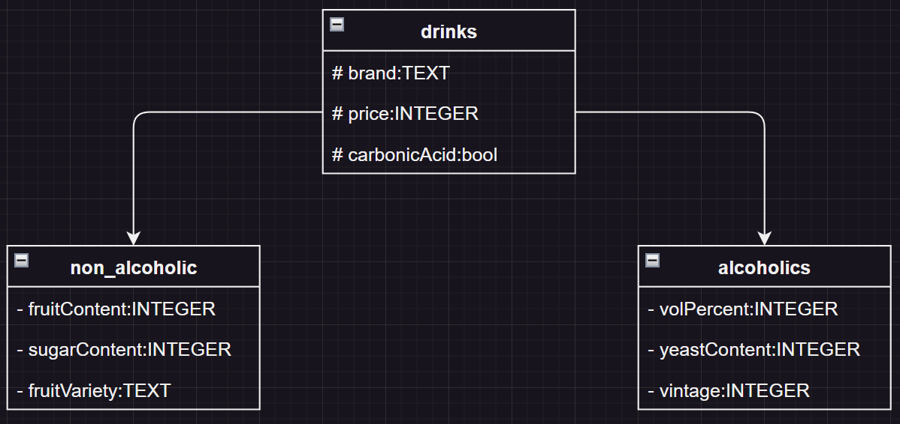

## Task a

Generalize: "lemonade", "fruit juice"

Supper Class: Non_alcoholic

Generalize: "Beer", "Wine", "Sparkling wine"

Supper Class: alcoholics

## Task b

Generalize the Supper Classes from a

Supper Class: drinks

## Task c

