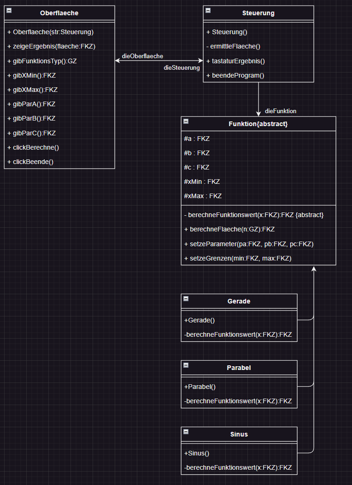

# Task

Create a program that can determine the integral of the following functions:

1. Linear equation
2. Parabolic equation
3. Sinus equation

# Sub-Tasks

1. Create a class diagram with all the needed classes
2. Create a sequence diagram for the sequence that an user wanted the integral of a parabolic equation
3. Write the pseudo code for the operation calcArea
4. Optimize the pseudo code of task 3

## Task 1



## Task 2


## Task 3
```
OPERATION berechneFlaeche(n:GZ) : FKZ
    wertRueckgabe : FKZ
    xWert : FKZ
    deltaX : FKZ

    wertRueckgabe <- 0
    xWert <- xMin
    deltaX <- (|xMin| + |xMax|) / 100

    FÜR i <- 0 BIS i < n SCHRITT 1
        wertRueckgabe <- wertRueckgabe + |berechneFunktionswert(xWert) * dektaX|
        xWert <- xWert + deltaX

RÜCKGABE wertRueckgabe
 ```
## Task 4 
```
OPERATION berechneFlaeche2(epsilion:FKZ, wertAlt:FKZ, n:GZ) : FKZ
    wertRueckgabe : FKZ
    xWert : FKZ
    deltaX : FKZ

    wertRueckgabe <- 0
    xWert <- xMin
    deltaX <- (|xMin| + |xMax|) / n

    FÜR i <- 0 BIS i < n SCHRITT 1
        wertRueckgabe <- wertRueckgabe + |berechneFunktionswert(xWert) * dektaX|
        xWert <- xWert + deltaX

    WENN xWert - wertAlt <= epsilion
        RÜCKGABE xWert
    SONST
        berechneFlaeche2(epsilion, wertAlt, n <- n +10)

RÜCKGABE wertRueckgabe
```