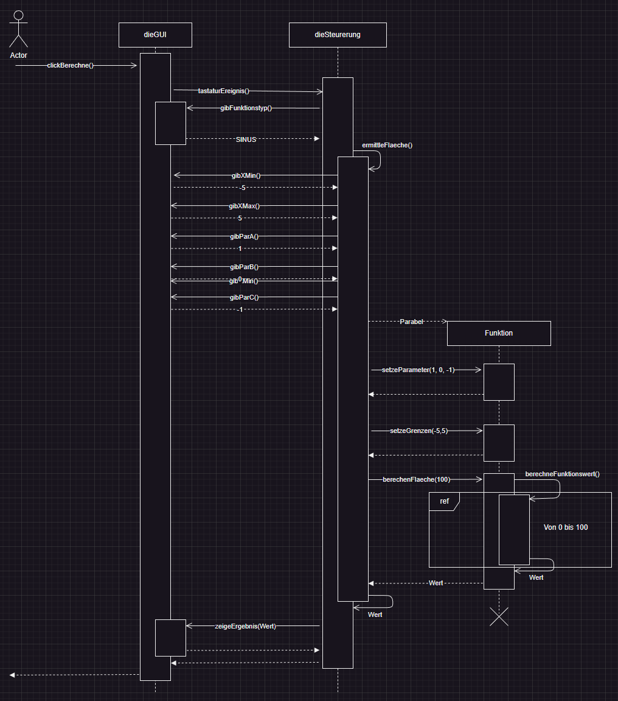

# Task

Create a program that can determine the integral of the following functions:

1. Linear equation
2. Parabolic equation
3. Sinus equation

# Sub-Tasks

1. Create a class diagram with all the needed classes
2. Create a sequence diagram for the sequence that an user wanted the integral of a parabolic equation
3. Write the pseudo code for the operation calcArea
4. Optimize the pseudo code of task 3

## Task 1

// TODO

## Task 2

## Task 3

// TODO

## Task 4 

// TODO