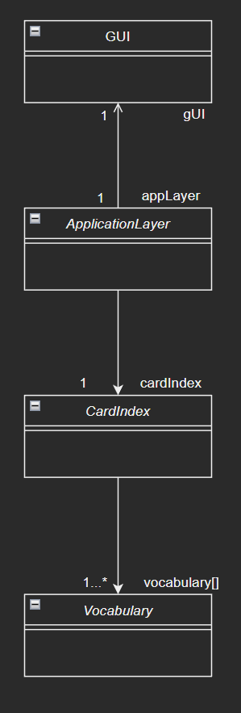

# Project vocabulary trainer (A-levels 2003)

# Task definition

A simple vocabulary trainer is to be created. The administration of the vocabulary is not part of the task, but only the part with which the vocabulary is practiced. The GUI is already provided.


## Task 1

### Task definition
Depict the associations between the four classes shown above in a class diagram in UML notation. The role name and cardinality must be specified for the associations. Cardinality must be specified. To display the classes, it is sufficient here if you only the class name. Attributes and operations do not need to be entered. 


### Solution



## Task 2

### Task definition
The operation zaehleBeherrschteVokabeln() counts how many vocabulary items in the card file have been answered correctly at least three times in succession. For these vocabulary items the value of the richtigeAntwort attribute is greater than 2. Describe the algorithm for this operation in pseudocode. Assume that the objects of the Vocabulary class are created in an array.

### Solution

    OPERATION zaehleBeherrschteVokabeln() : GZ
        local varvariables: anzVokabeln <- 0 : GZ

        FÜR i <- 0 BIS dieAnzahl - 1 SCHRITT 1
            WENN vocabulary[i].getRichtigeAntwort() > 2
                anzVokabeln <- anzVokabeln + 1
            ENDE WENN
        ENDE FÜR

    RÜCKGABE anzVokabeln

``` C#
public int zaehleBeherrschteVokabeln(){
    int anzVokabeln = 0;

    for(int i = 0; i < dieAnzahl; i++){
        anzVokabeln = (vokabeln[i].getRichtigeAntwort() > 2) ? anzVokabeln + 1 : anzVokabeln;
    }

    return anzVokabeln;
}
```

OR 

``` C#
public int zaehleBeherrschteVokabeln(){
    int anzVokabeln = 0;

    for(int i = 0; i < dieAnzahl; i++){
        if(vokabeln[i].getRichtigeAntwort() > 2)
            anzVokabeln++;        
    }

    return anzVokabeln;
}
```

## Task 3

### Task definition 

The operation waehleVokabel() of the class CardIndex searches for the instance of vocabulary[i] for for which the expression "dieVersuche + 2⋅richtigeAntwort" has the smallest value. If there are several words that fulfill this criterion, any one of these words can be selected.
The operation waehleVokabel() stores the index of the selected vocabulary in the attribute derIndex (for the operation pruefeAntwort()) and passes the value of the attribute of englischesWort of the found vocabulary to the sender of the message.
Design the algorithm of the operation waehleVokabel() and represent it in a pseudocode.

### Solution

    OPERATIOn waehleVokabel() : TEXT
        local variables: vocBuffer[] : LIST, minValueVoc : GZ, tmpMinValue : GZ, randNumb : GZ

        WENN dieAnzahl == 1
            RÜCKGABE vocabulary[0].getEnglischesWort()

        minValueVoc <- vocabulary[0].getDieVersuche() + 2 * vocabulary[0].getRichtigeAntworten()

        AddItem(vocBuffer, 0)

        FÜR i <- 1 BIS dieAnzahl - 1 SCHRITT 1
            tmpMinValue <- vocabulary[i].getDieVersuche() + 2 * vocabulary[i].getRichtigeAntworten()

            WENN tmpMinValue < minValueVoc
                minValueVoc <- tmpMinValue
                Clear(vocBuffer)
                AddItem(vocBuffer, i)
            ENDE WENN

            WENN tmpMinValue == minValueVoc
                AddItem(vocBuffer, i)
            ENDE WENN
        ENDE FÜR

        WENN size(vocBuffer > 1)
            randNumb <- genRandomInt[0, size(vocBuffer)]
            derIndex <- vocBuffer[randNumb]
        SONST
            derIndex <- vocBuffer[0]
        ENDE WENN 

        RÜCKGABE vocabulary[derIndex].getEnglischesWort()


``` C#
public string waehleVokabel(){
    int minValueVoc, tmpMinValue, randNumb;
    Random random = new Random();
    List vocBuffer = new List<int>() {0};

    if(dieAnzahl == 1){
        derIndex = 0;
        return vocabulary[derIndex].getEnglischesWort();
    }

    minValueVoc = vocabulary[0].getDieVersuche() + (2 *vocabulary[0].getRichtigeAntwort()); 

    for(int i = 1; i < dieAnzahl; i++){
        tmpMinValue = vocabulary[i].getDieVersuche() + (2 *vocabulary[i].getRichtigeAntwort());

        if(tmpMinValue < minValueVoc){
            minValueVoc = tmpMinValue;
            vocBuffer.Clear();
            vocBuffer.Add(i);
        }

        if(tmpMinValue == minValueVoc)
            vocBuffer.Add(i);
    }

    if(vocBuffer.Count > 1){
        randNumb = random.Next(0,vocBuffer.Count);
        derIndex = vocBuffer[randNumb];
    }
    else{
        derIndex = vocBuffer[0];
    }

    return vocabulary[derIndex].getEnglischesWort();
}
```
## Task 4

### Task definition 
The example scenario "Taste 2 ('fertig') is pressed" is to be modeled in a sequence diagram for 
the following boundary conditions:
- In Ausgabefeld 1, the program has output the word "friendly".
- The selected vocabulary (vocabulary[29]) has never been answered correctly.
- The user has entered the wrong answer "höflich" in the input field.
- The card index contains 37 words.
- Five of these words have the status "nicht beherrscht". 
Display all messages and answers that are exchanged between the objects of the four classes shown above. 
classes shown above. The actual values passed must be specified for the parameters and responses.
You can add a missing method for processing the click on the button in the class diagram and thus use it in the sequence diagram

### Solution

## Task 5

### Task definition 

### Solution

