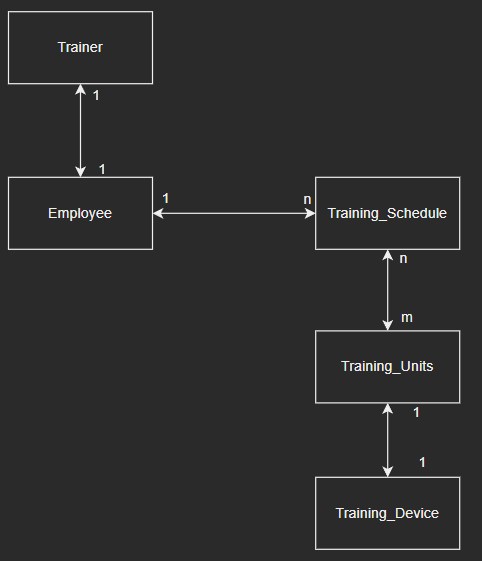

# Task

## Task definition
A software company wants to promote the health of its employees and offers them the opportunity to 
employees the opportunity to carry out training sessions in cooperation with a rehabilitation facility. 
The following situations are to be illustrated:
- A trainer supervises several employees, each employee has a fixed trainer. The first and last names of the trainers and employees are managed.
- An employee can have several training plans.
- A training plan consists of several training sessions and is valid for a specific month of the year and an employee.
- Each training session takes place on one piece of equipment. For each training session 
the date, the duration in minutes and the weight setting.
Design an entity-relationship model and specify the solution in relation notation. 

Clearly identify primary and foreign keys

## Solution

trainer(id, surname, firstname)

employee(id, surname, firstname, trainer_id)

trainingSchedule(id, month, year, employee_id)

trainingUnit(id, date, duration, weight, trainingDevice_id)

trainingDevice(id, place)

plan(id, trainingSchedule_id, trainingUnits_id)